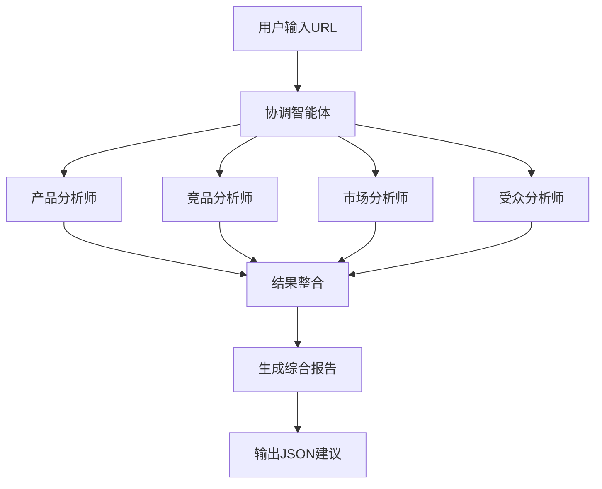

# Multi-Agents 广告前期分析系统

## 项目概述

Multi-Agents 是一个基于 AWS Bedrock Agent Core 的智能广告前期分析系统，通过多智能体协作的方式，为广告投放提供全面的产品分析、市场研究和受众洞察。

## 核心架构

### 🎯 核心组件

#### 1. ads_go_agent_as_tool_core_agent.py
**主要功能：** 多智能体协调核心引擎

**核心特性：**
- **多层级智能体架构：** 实现了两种多智能体编排模式
  - **Agent Graph 模式：** 基于星型拓扑的智能体图，支持复杂的智能体间通信
  - **Tool-based 模式：** 将专业智能体封装为工具，由协调智能体统一调度

- **专业智能体团队：**
  - **产品分析师 (Product Analyst)：** 深度挖掘产品特征、定位和价值主张
  - **竞品分析师 (Competitor Analyst)：** 全面分析竞争对手和市场差异化机会
  - **市场分析师 (Market Analyst)：** 研究市场规模、趋势和投放时机
  - **受众分析师 (Audience Analyst)：** 精准描绘目标用户画像和行为特征

- **智能协调机制：**
  - 项目总监智能体负责任务分解和结果整合
  - 支持并行处理，提升分析效率
  - 质量自检机制确保分析准确性

#### 2. deploy_agent_core.py
**主要功能：** AWS Bedrock Agent Core 部署脚本

**核心配置：**
```python
agent_name = "ads_go_pre_advertisement_agent"
entrypoint = "ads_go_agent_as_tool_core_agent.py"
execution_role = "arn:aws:iam::517141035927:role/agentcore-strands_claude-role"
```

**部署特性：**
- 自动创建 ECR 仓库
- 配置执行角色和权限
- 支持多区域部署
- 集成 AWS 可观测性服务

#### 3. Dockerfile
**主要功能：** 容器化部署配置

**关键配置：**
- **基础镜像：** `python:3.13-slim`
- **工作目录：** `/app`
- **端口暴露：** `8080`
- **安全配置：** 非 root 用户运行
- **可观测性：** 集成 OpenTelemetry 监控

**优化特性：**
- 多阶段构建优化镜像大小
- 缓存友好的依赖安装
- 环境变量配置支持
- 健康检查机制

#### 4. .bedrock_agentcore.yaml
**主要功能：** Bedrock Agent Core 配置文件

**核心配置项：**
```yaml
default_agent: ads_go_pre_advertisement_agent
agents:
  ads_go_pre_advertisement_agent:
    platform: linux/arm64
    container_runtime: docker
    aws:
      execution_role: arn:aws:iam::517141035927:role/agentcore-strands_claude-role
      region: us-west-2
      network_configuration:
        network_mode: PUBLIC
      observability:
        enabled: true
```

## 技术栈

### 核心框架
- **Strands Agents：** 多智能体编排框架
- **AWS Bedrock：** 大语言模型服务
- **Bedrock Agent Core：** 智能体运行时环境

### 模型配置
- **主模型：** Claude-3.5-Sonnet (us.anthropic.claude-3-7-sonnet-20250219-v1:0)
- **搜索引擎：** Exa API 集成
- **超时配置：** 读取超时 1800s，连接超时 900s

### 依赖管理
```
strands-agents              # 智能体框架
strands-agents-tools        # 工具集成
bedrock-agentcore          # 运行时核心
aws-opentelemetry-distro   # 可观测性
boto3                      # AWS SDK
```

## 快速开始

### 1. 环境准备
```bash
# 安装依赖
pip install -r requirements_core_agent.txt

# 配置 AWS 凭证
aws configure
```

### 2. 本地测试
```bash
# 直接运行智能体
python ads_go_agent_as_tool_core_agent.py
```

### 3. 部署到 Bedrock Agent Core
```bash
# 执行部署脚本
python deploy_agent_core.py
```


## API 使用

### 请求格式
```bash
curl -X POST http://localhost:8080/invocations \
  -H "Content-Type: application/json" \
  -d '{"prompt": "分析一下 https://www.example.com/"}'
```

### 响应格式
系统将返回包含以下内容的综合分析报告：
- 产品特征和定位分析
- 竞品对比和差异化机会
- 市场规模和投放时机建议
- 目标受众画像和媒体偏好
- JSON 格式的投放建议（国家、预算、媒体、ROAS）

## 智能体工作流程



## 配置说明

### 环境变量
```bash
AWS_REGION=us-west-2
AWS_DEFAULT_REGION=us-west-2
DOCKER_CONTAINER=1
```

### 权限要求
- Bedrock 模型调用权限
- ECR 仓库访问权限
- CloudWatch 日志写入权限
- Agent Core 运行时权限

## 监控和日志

### 可观测性配置
- **OpenTelemetry：** 自动追踪和指标收集
- **CloudWatch：** 日志聚合和告警
- **X-Ray：** 分布式追踪

### 关键指标
- 智能体响应时间
- 任务成功率
- 资源使用情况
- 错误率和异常

## 故障排除

### 常见问题
1. **权限错误：** 检查 IAM 角色配置
2. **超时问题：** 调整 Bedrock 配置中的超时设置
3. **容器启动失败：** 验证 Dockerfile 和依赖安装

### 调试模式
```bash
# 启用详细日志
export LOG_LEVEL=DEBUG
python ads_go_agent_as_tool_core_agent.py
```

## 扩展开发

### 添加新的智能体
1. 在 `ads_go_agent_as_tool_core_agent.py` 中定义新的 `@tool` 函数
2. 配置专业的系统提示词
3. 将新工具添加到协调智能体的工具列表

### 自定义分析维度
- 修改各智能体的系统提示词
- 调整质量自检清单
- 扩展输出格式

## 许可证

本项目遵循相关开源许可证，具体请查看项目根目录的 LICENSE 文件。

## 贡献指南

欢迎提交 Issue 和 Pull Request 来改进项目。请确保：
- 代码符合项目规范
- 添加适当的测试用例
- 更新相关文档

---

**注意：** 本系统需要有效的 AWS 账户和相应的服务权限才能正常运行。请确保在部署前完成必要的 AWS 配置。